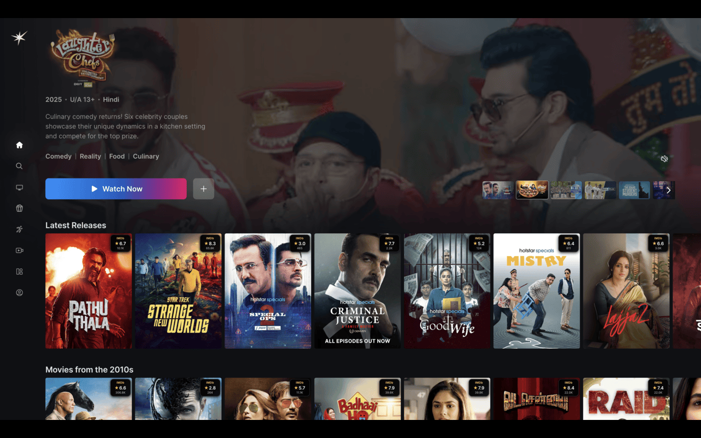

# IMDBuddy 🎥

A smart, modular browser extension that displays **instant IMDB ratings** while browsing Netflix, Hotstar, Prime Video, and other streaming platforms. Never wonder "Is this worth watching?" again!

**Supported Platforms**: Hotstar • Netflix • Prime Video • Disney+ ✨

**Available For**: Chrome • Safari (Web Extension) 🌐

## ✨ Features

- **🧠 Smart Matching**: Advanced fuzzy matching finds ratings even with title variations.
- **⚡️ Instant Results**: Cached results for lightning-fast performance.
- **🎨 Beautiful Overlays**: Non-intrusive rating displays that blend seamlessly.
- **🌐 Multi-Platform**: Works across Netflix, Hotstar, Disney+, and Prime Video.
- **🔄 Auto-Updates**: Dynamically loads ratings as you browse.
- **🏗️ Modular Architecture**: 99% code sharing between Chrome and Safari.

## 🚀 Getting Started

For detailed instructions on how to build the extension from source, install it in your browser, and add support for new streaming platforms, please see our comprehensive guide:

**➡️ [Building and Deploying IMDBuddy](./BUILD-AND-DEPLOY.md)**

## 🏗️ Architecture

IMDBuddy is built with a modular, shared-code architecture that allows for 99% code sharing between the Chrome and Safari extensions. This makes maintenance simple and adding new features a breeze.

For a deep dive into the technical architecture, component breakdown, and development best practices, please see our detailed architecture document:

**➡️ [IMDBuddy Architecture](./ARCHITECTURE.md)**

## 🤝 Contributing

We welcome contributions! If you'd like to add a new feature, fix a bug, or add support for a new streaming platform, please see the **[Building and Deploying](./BUILD-AND-DEPLOY.md)** guide to get started.
